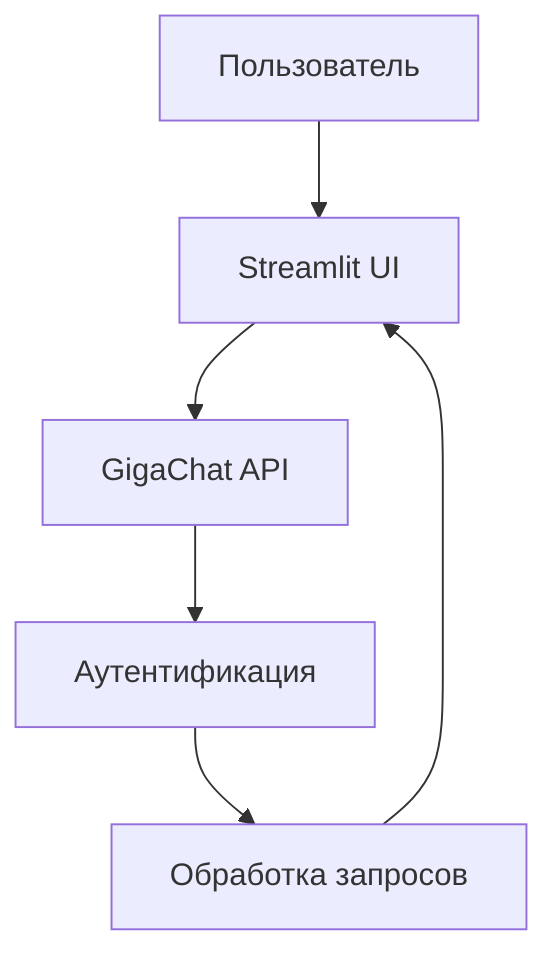

# GigaChat AI Assistant

## 📌 О проекте

GigaChat AI Assistant — это интерактивный веб-интерфейс для общения с AI-моделью GigaChat от Сбербанка. Проект реализован на Python с использованием Streamlit и предоставляет:

- 🗣️ Естественное взаимодействие на русском языке
- 💡 Получение развернутых ответов на сложные вопросы
- ✨ Плавные анимации ввода текста
- 🔒 Безопасное соединение через OAuth 2.0

## 🚀 Быстрый старт

### Предварительные требования
- Python 3.8+
- Аккаунт разработчика GigaChat ([регистрация](https://developers.sber.ru/))

### Установка

```bash
git clone https://github.com/yourusername/gigachat-assistant.git
cd gigachat-assistant
pip install -r requirements.txt
```

### Настройка
1. Запишите свои коды в gigachatapi

2. Запустите приложение:
```bash
streamlit run app.py
```

## 🖥️ Интерфейс


### Основные элементы:
- **Основное окно чата** - история диалога
- **Поле ввода** - для отправки сообщений
- **Боковая панель** - информация о проекте

## 🔧 Техническая реализация

### Архитектура


### Ключевые модули:
| Модуль | Назначение |
|--------|------------|
| `app.py` | Основной интерфейс Streamlit |
| `gigachatapi.py` | Логика работы с API GigaChat |
| `style.css` | Кастомные стили интерфейса |

## 📚 Документация API

### Метод авторизации
```python
def get_access_token():
    url = "https://ngw.devices.sberbank.ru:9443/api/v2/oauth"
    headers = {
        "Content-Type": "application/x-www-form-urlencoded",
        "Accept": "application/json",
        "RqUID": str(uuid.uuid4())
    }
    ...
```

### Параметры запроса:
| Параметр | Тип | Описание |
|----------|-----|----------|
| `scope` | str | Область доступа (GIGACHAT_API_PERS) |
| `RqUID` | UUID | Уникальный идентификатор запроса |

## 🌟 Особенности
- **Анимация набора текста** - имитация живого общения
- **Контекст диалога** - сохранение истории в течение сессии
- **Адаптивный дизайн** - корректное отображение на мобильных устройствах

## ⚠️ Ограничения
- Лимит запросов к API
- Требуется интернет-соединение

## 🤝 Контакты
По вопросам сотрудничества:
- Email: offconix@gmail.com
- Telegram: @onixxed 
- GitHub: [onix](https://github.com/oonixxxxx)
```
